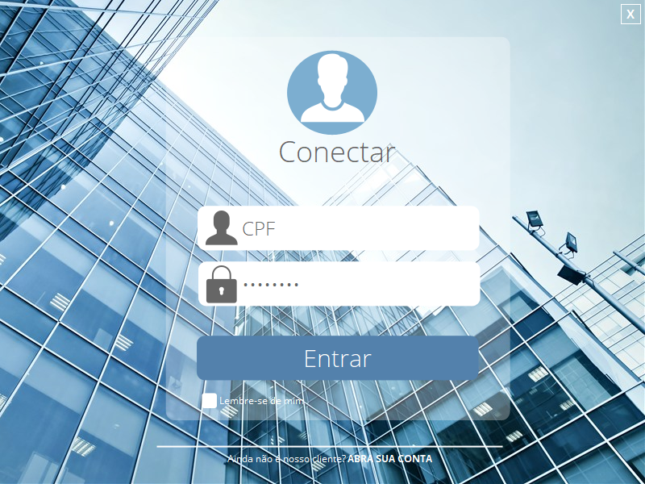
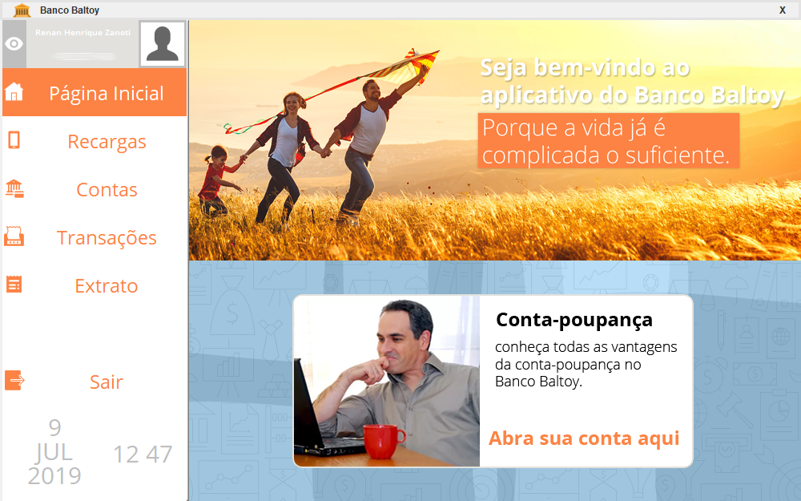

# Sistema Bancario Simples
Um sistema que busca simular um software bancário simples, com conexão com um banco de dados, desenvolvido em linguagem Java e usando o WindowsBuilder como ferramenta de auxílio para lidar com a interface gráfica.
Trata-se de um trabalho final da cadeira de Banco de Dados 1 lecionada na Universidade Federal de Ouro Preto (UFOP) com tema livre. O código do trabalho foi finalizado no dia 29 de novembro de 2018.

*Para acessar mais imagens de pré-visualização [clique aqui](https://github.com/renanzan/Java_IG_BD_Sistema_Bancario_Simples/tree/master/preview)*.

*Para informações sobre a modelagem do banco de dados [clique aqui](https://github.com/renanzan/Java_IG_BD_Sistema_Bancario_Simples/tree/master/modelagem)*.

***Os scripts de criação das tabelas do banco de dados necessárias para o funcionamento do programa estão inseridas dentro do próprio código. Em uma primeira execução do software só é necessário que o SGBD esteja sendo executado.***

Há um sistema de login e cadastro de cliente, os dados são armazenados no banco de dados.

A página inicial que é apresentada ao cliente logado possui uma listagem gráfica de botões de navegação que podem ser minimizados (hide/show) e anúncios fictícios do banco Baltoy.

## Bugs identificados
Alguns dos bugs mais evidentes que foram identificados e podem vir a ser resolvidos em atualizações futuras:

* O texto pronto de apoio (prompt text) no campo de texto referente ao CPF no frame de Login não é removido quando há uma entrada do usuário. 
* Ao efetuar um cadastro não há nenhuma mensagem de confirmação e o usuário não é redirecionado para o frame de login.
* O movimento da janela do software através do clique e arrasto do ponteiro sobre a barra de informações superior do software não possui um funcionamento satisfatório.
* Em Contas do usuário os botões de "Gerar cartão virtual" e "Baixar relatório do mês" são meramente ilustrativos e não resultam em ações.
* Em Contas as informações de "Saldo disponível" só são atualizadas quando os frames são alterados.
* O Extrato só é atualizado quando o software é fechado e aberto novamente.

## Versões
VERSÃO 1.0.0 [29/11/2018]
* Login e cadastro de clientes
* Opção de lembrar-se do último usuário logado
* Armazena e acessa imagem do usuário no banco de dados
* Possui função responsiva de esconder e mostrar os botões de navegação
* Efetua recarga de celular e armazena números favoritos
* Abertura de conta poupança
* Efetuar transferências e empréstimos
* Gerar extrato de conta corrente e conta poupança

## Construído com
* [Eclipse IDE](https://www.eclipse.org/) - A IDE utilizada.
* [MySQL](https://www.mysql.com/) - SGBD.

## Autores
* **Renan Zanoti** - *Trabalho de Algoritmo e Estrutura de Dados 2 (Sistemas de Informação, UFOP - ICEA)* - [renanzan](https://github.com/renanzan)
